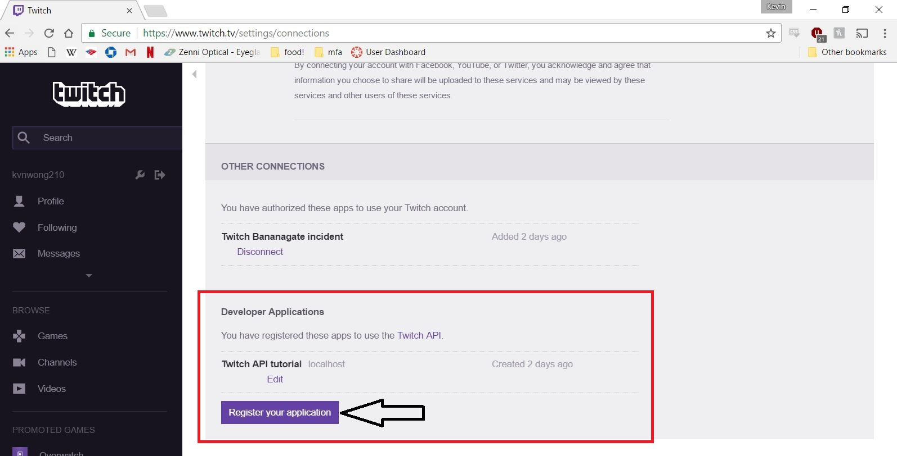

# Welcome to the Guide on The Twitch Clip API

Have you've ever made a sweet play in your game that you just wish the whole world could see? Get a headshot from across the map? Come back from a 3-1 deficit? Well, by combining Twitch's free video streaming services and the power of their video embedding API, you'll be able to share those rare moments on your site or page and this is the guide to get you started! 

With Twitch's video embedding API, users are able to pull saved clips from any game or channel, including their own.  

By the end of this tutorial and with a little help from AJAX, you should be able to embed any of your twitch clips on your own site, like the example below.


## Getting Started

A general overview of the Twitch API in general can be found [here](https://dev.twitch.tv/docs). With Twitch's API, users can embed live-stream videos and saved clips, create chat-bots, and take actions based on an existing twitch account.
For this guide, we will focus on the clip embedding feature of the API using AJAX calls on javascript. 

Before we begin coding, we will need a client-id from Twitch. Any use of Twitch's API now require an authorization token. To get your own token you will first need to get a Twitch account. An account can be made [here](https://www.twitch.tv/) by going to top right portion of the page and clicking on sign-up


Once you have an account, navigate to the [settings](https://www.twitch.tv/settings/) page and then go to the [connections](https://www.twitch.tv/settings/connections) tab.
At the bottom of the page you will find a button to register your application.



By clicking this button you will be taken to a forms page, where you can begin registering for a client-id.
For our example problem we will name our application "My Awesome Play", but feel free to name yours to whatever you'd like. Because we are setting up the API locally, we will be using http://localhost as our redirect URI. Feel free to also use this as your redirect URI for your site. Lastly we have the application category. For this, our category will be a Website Integration.
When you have it all filled out, your form should look something similar to the one seen below.


Check the terms and agreement box, and hit the register button to recieve your own client-id.


Your client-ID ready to be used!

##Setting Up The Site

Now that we have a client-ID, we can begin coding! 

For our demo site, we have created a simple webpage that will embed our clips video. 

'''
<html>
<head>
   <title>Twitch Tutorial</title>
</head>
<body>
	<div>My Awesome Kill!</div>
   <div id="clips-display"></div>
    <script src="TwitchClip.js"></script>
</body>
</html>
'''

Whenever you commit to this repository, GitHub Pages will run [Jekyll](https://jekyllrb.com/) to rebuild the pages in your site, from the content in your Markdown files.

### Markdown

Markdown is a lightweight and easy-to-use syntax for styling your writing. It includes conventions for

```markdown
Syntax highlighted code block

# Header 1
## Header 2
### Header 3

- Bulleted
- List

1. Numbered
2. List

**Bold** and _Italic_ and `Code` text

[Link](url) and 
```

For more details see [GitHub Flavored Markdown](https://guides.github.com/features/mastering-markdown/).

### Jekyll Themes

Your Pages site will use the layout and styles from the Jekyll theme you have selected in your [repository settings](https://github.com/kvnwong/kvnwong.github.io/settings). The name of this theme is saved in the Jekyll `_config.yml` configuration file.

### Support or Contact

Having trouble with Pages? Check out our [documentation](https://help.github.com/categories/github-pages-basics/) or [contact support](https://github.com/contact) and we’ll help you sort it out.
