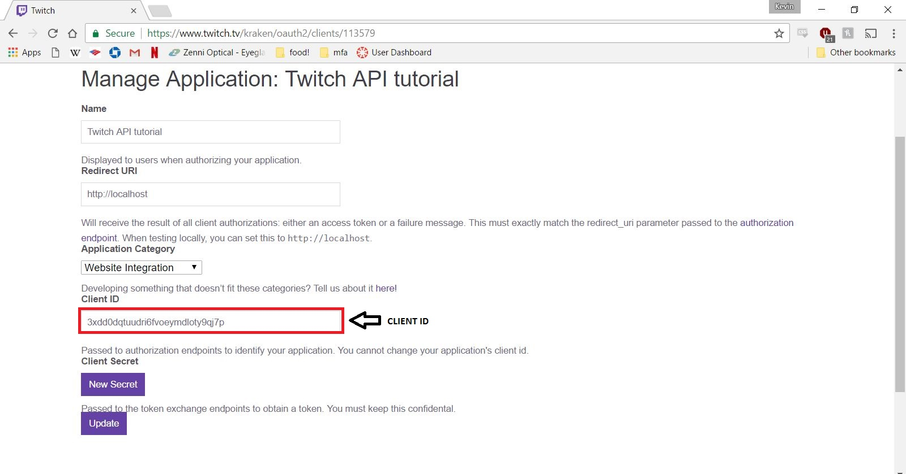

# Welcome to the Guide on The Twitch Clip API

Have you've ever made a sweet play in your game that you just wish the whole world could see? Get a headshot from across the map? Come back from a 3-1 deficit? Well, by combining Twitch's free video streaming services and the power of their video embedding API, you'll be able to share those rare moments on your site or page and this is the guide to get you started! 

With Twitch's video embedding API, users are able to pull saved clips from any game or channel, including their own.  

By the end of this tutorial and with a little help from AJAX, you should be able to embed any of your twitch clips on your own site, like the example below.

## Getting Started

A general overview of the Twitch API in general can be found [here](https://dev.twitch.tv/docs). With Twitch's API, users can embed live-stream videos and saved clips, create chat-bots, and take actions based on an existing twitch account.
For this guide, we will focus on the clip embedding feature of the API using AJAX calls on javascript. 

Before we begin coding, we will need a client-id from Twitch. Any use of Twitch's API now require an authorization token. To get your own token you will first need to get a Twitch account. An account can be made [here](https://www.twitch.tv/) by going to top right portion of the page and clicking on sign-up

Once you have an account, navigate to the [settings](https://www.twitch.tv/settings/) page and then go to the [connections](https://www.twitch.tv/settings/connections) tab.
At the bottom of the page you will find a button to register your application.

By clicking this button you will be taken to a forms page, where you can begin registering for a client-id.
For our example problem we will name our application "My Awesome Play", but feel free to name yours to whatever you'd like. Because we are setting up the API locally, we will be using http://localhost as our redirect URI. Feel free to also use this as your redirect URI for your site. Lastly we have the application category. For this, our category will be a Website Integration.
When you have it all filled out, your form should look something similar to the one seen below.

Check the terms and agreement box, and hit the register button to recieve your own client-id.

Your client-ID ready to be used!

##Setting Up The Site

Now that we have a client-ID, we can begin coding! 

For our demo site, we have created a simple webpage that will embed our clips video. 

    <html>
    <head>
       <title>Twitch Tutorial</title>
    </head>
    <body>
	
My Awesome Kill!

       

       
     </body>
    </html>

The above code will serve as a simple template for outputting our stream. The clip will be embedded at the second 
. The bulk of our project however, will occur in our javascript file, TwitchClip.js.

##Making AJAX Call to Twitch

To start we will open up a new javascript file. In our case, this file is named TwitchClip.js. We begin with an Ajax request

    var request = new XMLHttpRequest();

Next we will set-up our URL. The basic get URL for a twitch clip will be 

    var base = "https://api.twitch.tv/kraken/clips/"

From there, we have several options to append to our URL to make the call more specific. We can either a)Embed a single clip from a specific user or b) Embed multiple top clips.
We will start our project by first embedding a clip from a specific user.

###Getting User Clip URL

To embed a specific clip, we will need to append to our URL a "slug", which is a unique string generated for every clip. To get a clip's specific slug, navigate and click on the clip of interest.

At the bottom, you will notice a URL in the form of

    https://clips.twitch.tv/<slug>
	
Where the slug is the string that will be our slug. Using our example clip, we can finally generate a complete URL to make our API call.

    var slug = "BreakableRoundMoonBrokeBack"
	var URL = base + slug;
	 
With our URL in hand, we make our GET request

    request.open('GET',URL);
	
After specifying the type of request we are making, we will also add required headers to our request in order to access the clip.

The first header will be our client-ID.

     var clientID = '3xdd0dqtuudri6fvoeymdloty9qj7p';
	 request.setRequestHeader('Client-ID', clientID);
	 
The second header to add will let the server know which version we are accessing.

	request.setRequestHeader('Accept', 'application/vnd.twitchtv.v4+json');

###Handling API Response

We now move onto how we will handle the API response. A response using the provided URL and headers will be returned in JSON format. The repsonse will be a single object as seen below.

![clip response]clipresponse.JPG

What we are specifically interested for embedding a clip is the embed_html portion of the JSON object. We will now access and add the embed_html to our webpage using the clipsLoaded function.

     request.addEventListener('load', clipsLoaded);

The above line will execute the clipsLoaded function once the GET request has been loaded. 
     
    function clipsLoaded() {
   
    var clipList = JSON.parse(request.responseText);
    var clipsDisplay = document.getElementById('clips-display');
    clipItem = document.createElement('div');
	clipItem.innerHTML = clipList.embed_html;
	clipsDisplay.appendChild(clipItem);
	}
	
Let's go over what is happening in the clipsLoaded function:

    var clipList = JSON.parse(request.responseText);

The above line will parse the JSON object returned by the request into javascript object such that we can access each indiviual element of the object more easily.

    var clipsDisplay = document.getElementById('clips-display');
    clipItem = document.createElement('div');
	clipItem.innerHTML = clipList.embed_html;
	clipsDisplay.appendChild(clipItem);
	
The code shown above uses the DOM to access the html and creates a div. The clip we want is then accessed through the parsed JSON code. The portion we are interested in (embed_html) is called by clipList.embed_html and then appeneded to the html.

The very last piece of code that we will add to our javascript is:

     request.send();
	 
This will send our GET request to Twitch.

##Final Code

If you followed our example step by step, then by the end you should have a javascript similar to the one seen below:

    var request = new XMLHttpRequest();

    var base = "https://api.twitch.tv/kraken/clips/"
    var slug = "BreakableRoundMoonBrokeBack"
    var URL = base + slug;

    request.addEventListener('load', clipsLoaded);
    request.open('GET', URL);
    var clientID = '3xdd0dqtuudri6fvoeymdloty9qj7p';
    request.setRequestHeader('Client-ID', clientID);
    request.setRequestHeader('Accept', 'application/vnd.twitchtv.v4+json');

    request.send();

    function clipsLoaded() {
    var clipsDisplay = document.getElementById('clips-display'),
        clipList = JSON.parse(request.responseText);

	clipItem = document.createElement('div');
	clipItem.innerHTML = clipList.embed_html;
	clipsDisplay.appendChild(clipItem);
	 }

###Other Clips to Embed

As mentioned previously, users can also embed clips from a particular game instead of a user. In order to do this, some simple modifications must be made to the URL passed and the load function.

    var base = "https://api.twitch.tv/kraken/clips/top"
	
With out new base URL, we can append several parameters to it to specify what clip in particular we are interested in.

For example, if we wanted the top 4 clips from the game Overwatch within the past week sorted by popularity, our URL would be

    var URL = "https://api.twitch.tv/kraken/clips/top?game=Overwatch&limit=5&trending=true&period=week"
	request.open('GET', URL);
	
Our request headers will still remain the same, however the JSON returned by the call is a bit different than the one seen previously.
This time, the object returned is an array of clips equal to the number of clips requested. In our case this would be 4. To embed this video, we still require the embed_html as seen below.

In order to access every clips embed_html, we will use the forEach method in our clipList function to loop through the array, create a div and add the embed_html to the div.

    clipList.clips.forEach(function(clip, index, array) {
    clipItem = document.createElement('div');
    clipItem.innerHTML = clip.embed_html;
    clipsDisplay.appendChild(clipItem);
	
Our new clipList function should now look like:

    function clipsLoaded() {
    var clipsDisplay = document.getElementById('clips-display'),
        clipList = JSON.parse(request.responseText);

		console.log(clipList);
    clipList.clips.forEach(function(clip, index, array) {
        clipItem = document.createElement('div');
        clipItem.innerHTML = clip.embed_html;
        clipsDisplay.appendChild(clipItem);
    });
    }   

The webpage should now contain multiple top clips, all from Overwatch that were created within the past week.

##Get To Showcasing Your Own Clips

After going through this guide, you should now be able to access Twitch's API to get any clips you want to add to your own website. You can customize your own site to have top plays from popular games, or from a specific channel or plays you made yourself! So go out there and get ready to show the world what awesome gaming skills you have! 

